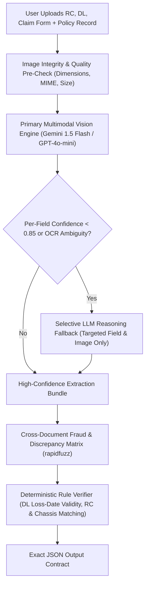

# ClaimPilot AI — Production Document Verification Agent

A production-grade, high-reliability FastAPI microservice designed for motor insurance claims. It extracts, cross-verifies, and forensically audits:
1. **Registration Certificate (RC)**
2. **Driving Licence (DL)**
3. **Claim Intimation Form**

---

## 🏛️ Production Architecture: Tiered Hybrid OCR + LLM Fallback



---

## 🛡️ Production Capabilities Added

### 1. **Tiered Selective LLM Fallback (Efficiency + Accuracy)**
* Primary extraction calculates **granular per-field confidence scores** (`owner_name_confidence`, `chassis_number_confidence`, `expiry_date_confidence`, etc.).
* If any critical field's confidence drops below `OCR_CONFIDENCE_FALLBACK_THRESHOLD` (e.g. `< 0.85`) or contains OCR visual ambiguity (e.g. `0` vs `O`, `1` vs `I`, `8` vs `B` on dirty/crumpled Indian documents):
  * The service **does not** re-extract the whole document bundle.
  * It selectively invokes a **targeted forensic LLM disambiguation call** with *only* the specific low-confidence field and its relevant image crop to resolve the ambiguity with zero wasted tokens.

### 2. **Cross-Document Fraud & Entity Reconciliation Matrix**
* **Policy vs RC**: Verifies vehicle ownership match.
* **Policy vs DL**: Reconciles whether the driver is the policyholder, an authorized family member, or a designated commercial driver.
* **Policy vs Claim Form**: Flags unauthorized third-party claimant discrepancies.
* **RC vs Claim Form**: Cross-checks vehicle plate numbers across documents.

### 3. **Loss Date vs DL Expiry Forensics**
* Automatically extracts `incident_date` (date of accident) from the claim form.
* **Insurance Breach Check**: If the driver's licence expired *before* the date of the accident, the claim is automatically flagged with `status: "warning"` and a policy breach notification.

### 4. **Image Quality & Format Pre-Checks**
* Enforces minimum pixel dimensions ($200 \times 200\text{px}$) and file size limits (10MB).
* Performs PIL memory loading to catch corrupted or spoofed image files, returning clean `HTTP 422` errors.

---

## 📋 Exact Output Contract

```json
{
  "overall_status": "verified",
  "confidence_score": 0.97,
  "fields": [
    {
      "name": "owner_name",
      "value": "Rajesh Kumar Sharma",
      "confidence": 1.0,
      "status": "verified",
      "note": "Exact match against policy record",
      "isResolved": false
    },
    {
      "name": "rc_number",
      "value": "MH02CB1234",
      "confidence": 1.0,
      "status": "verified",
      "note": "Exact RC number match against policy record",
      "isResolved": false
    },
    {
      "name": "chassis_number",
      "value": "MA3EJKD1S00123456",
      "confidence": 1.0,
      "status": "verified",
      "note": "Exact 17-character chassis number match against policy record",
      "isResolved": false
    },
    {
      "name": "dl_number",
      "value": "DL-1420110012345",
      "confidence": 0.96,
      "status": "verified",
      "note": "Driving Licence number format valid and verified",
      "isResolved": false
    },
    {
      "name": "dl_validity",
      "value": "2029-08-15",
      "confidence": 0.98,
      "status": "verified",
      "note": "Driving Licence is valid (expires on 15-Aug-2029)",
      "isResolved": false
    }
  ],
  "extracted_plate_number": "MH02CB1234",
  "extracted_vehicle_meta": {
    "make": "Maruti Suzuki",
    "model": "Swift Dzire",
    "variant": "VXI",
    "registration_year": 2021
  },
  "extracted_damage_description_from_form": "Vehicle hit a stationary concrete divider while reversing at low speed. Front right bumper shattered, right headlight assembly broken, and minor fender dents on right side."
}
```

---

## ⚙️ Configuration (.env)

```ini
# Production Mode
MOCK_MODE=false

# Provider: "gemini" (Google Gemini Flash) or "openai" (GPT-4o)
VISION_PROVIDER=gemini
GEMINI_API_KEY=your_gemini_api_key_here
GEMINI_MODEL=gemini-1.5-flash

# OpenAI Alternative
OPENAI_API_KEY=your_openai_api_key_here
OPENAI_MODEL=gpt-4o-mini

# Thresholds
OCR_CONFIDENCE_FALLBACK_THRESHOLD=0.85
FUZZY_EXACT_THRESHOLD=98.0
FUZZY_MATCH_THRESHOLD=80.0
```

---

## 🚀 Running the Microservice

```bash
# 1. Install dependencies
pip install -r document_agent/requirements.txt

# 2. Run automated tests
pytest document_agent/tests/ -v

# 3. Start the server
uvicorn document_agent.main:app --reload --port 8000
```
