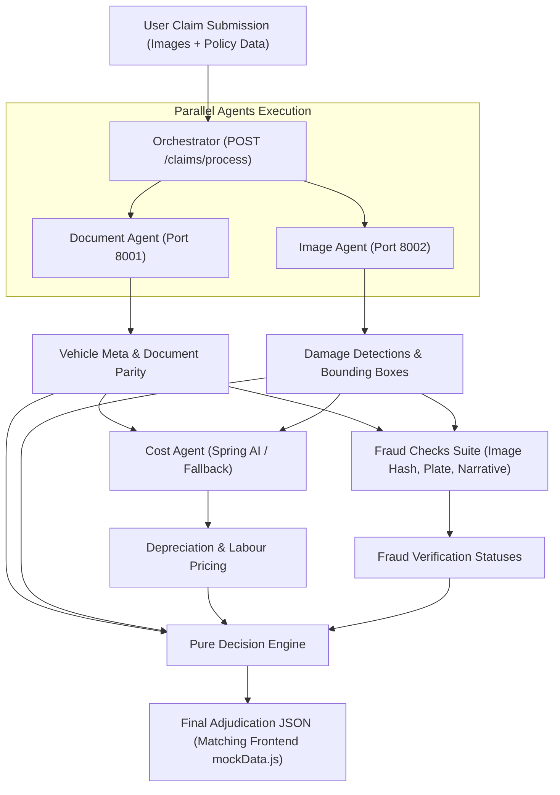

# ClaimPilot AI — Orchestrator & Decision Engine Microservice

The central coordination microservice for ClaimPilot AI. It concurrently calls:
1. **Document Verification Agent** (`DOCUMENT_AGENT_URL`)
2. **Image / Damage Assessment Agent** (`IMAGE_AGENT_URL`)
3. **Cost Reconciliation Agent (Spring AI)** (`COST_AGENT_URL`)
4. **Fraud Detection Suite** (Perceptual hash duplicate check, Plate parity, Narrative alignment)
5. **Deterministic Decision Engine** (Statutory ₹50k IRDAI inspection rule, Total Loss, Auto-Approval)

---

## 🏛️ System Architecture



---

## 🚀 Quickstart & Running

### 1. Install Dependencies
```bash
pip install -r orchestrator/requirements.txt
```

### 2. Configure Environment (.env)
```bash
cp orchestrator/.env.example orchestrator/.env
```

```ini
DOCUMENT_AGENT_URL=http://localhost:8001
IMAGE_AGENT_URL=http://localhost:8002
COST_AGENT_URL=http://localhost:8080/api/cost/estimate
COST_AGENT_MOCK_FALLBACK=true
IRDAI_MAX_AUTO_APPROVAL_LIMIT=50000.0
```

### 3. Run the Microservice
```bash
uvicorn orchestrator.main:app --reload --port 8000
```

Interactive API documentation:
- **Swagger UI**: `http://localhost:8000/docs`
- **ReDoc**: `http://localhost:8000/redoc`

---

## 📡 API Endpoints

### 1. Health Probe
`GET /health`
```json
{
  "status": "ok",
  "service": "ClaimPilot Orchestrator & Decision Engine",
  "version": "1.0.0",
  "connected_services": {
    "document_agent": "http://localhost:8001",
    "image_agent": "http://localhost:8002",
    "cost_agent": "http://localhost:8080/api/cost/estimate"
  }
}
```

---

### 2. Process Claim
`POST /claims/process`
**Content-Type**: `multipart/form-data`

#### Multipart Form Parameters:
| Field | Type | Description |
|---|---|---|
| `rc_image` | File | Registration Certificate image |
| `dl_image` | File | Driving Licence image |
| `claim_form_image` | File | Claim Intimation Form image |
| `damage_photos` | File Array | 1 to 8 physical vehicle damage photos |
| `policy_record` | Text (JSON) | `{"owner_name": "...", "rc_number": "...", "chassis_number": "...", ...}` |
| `claim_id` | String (Optional) | Tracking identifier, e.g. `CLM-2026-00842` |

---

## 📋 Exact Output Contract (Matching `js/mockData.js`)

```json
{
  "id": "clm_2026_00842",
  "claim_id": "CLM-2026-00842",
  "submission_timestamp": "21 Aug 2026, 09:42 AM IST",
  "status": "auto_approved",
  "status_label": "Auto-Approved",
  "status_description": "Claim meets all autonomous settlement criteria. No human surveyor required.",
  "vehicle": {
    "make": "Maruti Suzuki",
    "model": "Swift VXi",
    "year": 2021,
    "registration": "MH-12-RN-8842",
    "fuel": "Petrol"
  },
  "policy": {
    "number": "POL-PAC-9920194",
    "holder": "Rajesh Anand Kumar",
    "plan": "Comprehensive Bumper-to-Bumper Zero Dep",
    "expiry": "18 Nov 2026",
    "status": "Active"
  },
  "document_check": {
    "overall_status": "verified",
    "confidence_score": 0.98,
    "fields": [
      { "name": "owner_name", "value": "Rajesh Anand Kumar", "confidence": 1.0, "status": "verified", "note": "Exact match across RC, DL & Policy DB" }
    ]
  },
  "damage_assessment": {
    "severity": "moderate",
    "severity_label": "Moderate",
    "location": "front_impact",
    "location_label": "Front Bumper & Lower Grille",
    "detected_parts": [
      { "part": "Front Bumper", "type": "Moderate Damage", "action": "Replace & Paint", "confidence": "96%", "material_type": "plastic-rubber" }
    ],
    "photos_analyzed": 2,
    "no_damage_detected": false
  },
  "cost_estimate": {
    "final_low": 18000.0,
    "final_high": 24000.0,
    "formatted_final": "₹18,000 — ₹24,000",
    "recommended_payout": "₹21,200",
    "currency": "INR",
    "confidence": "high",
    "confidence_label": "High Agreement (94%)",
    "sources": [],
    "reasoning": "Multi-agent pricing sources agree within acceptable variance window.",
    "disclaimer": "Pre-inspection estimate. Final settlement subject to IRDAI limits."
  },
  "fraud_checks": [
    { "name": "Duplicate Claim Hash Check", "status": "passed", "detail": "No prior claim matches image perceptual hash (0/14,000)" },
    { "name": "Number Plate AI Parity", "status": "passed", "detail": "MH-12-RN-8842 verified on live photos against RC" },
    { "name": "Form vs. Image Metadata Consistency", "status": "passed", "detail": "Accident description matches visual damage isolated by vision pipeline" },
    { "name": "Live Camera Anti-Spoofing", "status": "passed", "detail": "Exif depth map and glare texture verify live capture" }
  ],
  "decision_trail": [
    { "step": "Validation Gate", "outcome": "Passed", "detail": "Policy in force, zero active disputes", "status": "completed", "timestamp": "09:42:02 AM" },
    { "step": "Document Verification", "outcome": "Verified, 98.0% confidence", "detail": "Owner, RC, and DL verified via Vahan & Sarathi matching", "status": "completed", "timestamp": "09:42:06 AM" },
    { "step": "Damage Assessment", "outcome": "Moderate damage, front impact", "detail": "Vision pipeline isolated damaged parts with high confidence", "status": "completed", "timestamp": "09:42:12 AM" },
    { "step": "Cost Reconciliation", "outcome": "High agreement across sources", "detail": "Multi-agent pricing converged at ₹21,200", "status": "completed", "timestamp": "09:42:18 AM" },
    { "step": "Fraud & Anomaly Scan", "outcome": "Zero anomalies detected", "detail": "Image perceptual hashes and metadata parity 100% clean", "status": "completed", "timestamp": "09:42:22 AM" },
    { "step": "Final Adjudication", "outcome": "Auto-Approved", "detail": "Automated digital settlement order generated and queued for disbursement", "status": "success", "timestamp": "09:42:26 AM" }
  ]
}
```

---

## ⚖️ Decision Rules & Statutory Matrix

| Condition | Status | Action / Rationale |
|---|---|---|
| **$\ge \text{₹50,000}$ Estimate** | **`flagged`** | **Mandatory IRDAI statutory rule (runs FIRST)**: On-site surveyor inspection required by law. |
| **Total Loss Flag ($\ge 75\%$ IDV)** | **`flagged`** | Constructive total loss; escalated to senior loss assessor. |
| **Fraud Anomaly / Doc Warning** | **`flagged`** | Routed directly to Special Investigation Unit (SIU). |
| **Resolved Doc / Medium Cost Conf** | **`under_review`** | Minor variance; queued for 1-click adjuster review. |
| **Verified + Passed + High Conf + $< \text{₹50k}$** | **`auto_approved`** | Instant digital settlement order generated. |

---

## 🧪 Running Automated Unit Tests

```bash
pytest orchestrator/tests/ -v
```
